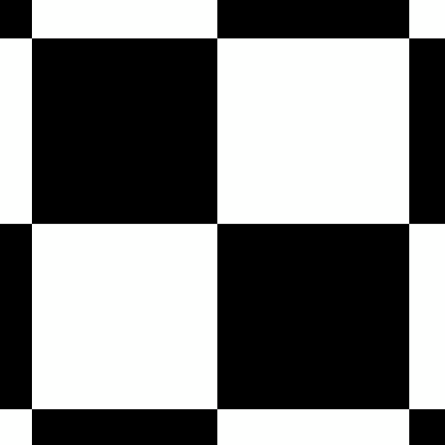
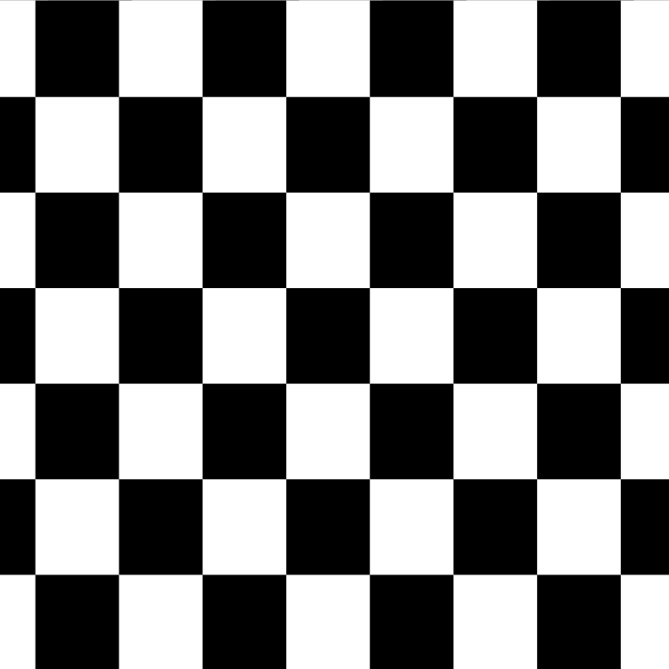
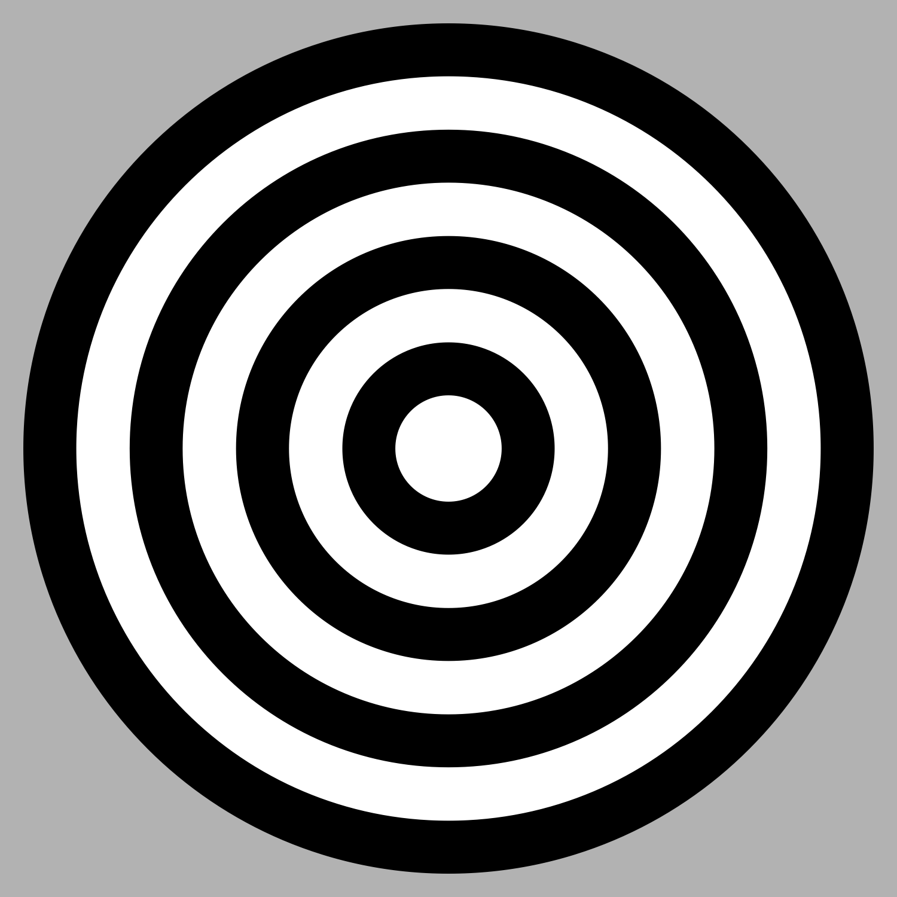

# many_babies_stim

Repo for Many Babies study 1 stimuli

## Experimental design

## Stimuli 

Note: gifs render extremely slowly in github markdown. 

### Low complexity

#### Squares

#### Circles

### High complexity

#### Squares

#### Circles

## Colors

https://github.com/MZaharieva/MBAH_ColorSwatches

## Notes

https://docs.google.com/document/d/1b1bhtzFyftc5a77UI47BcSK0TkOh9joLmRIzzSjsCPY/edit
